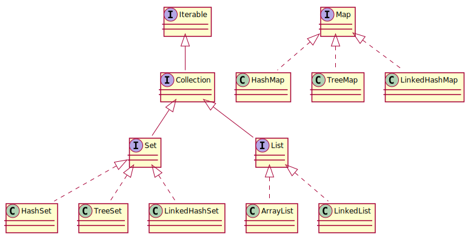
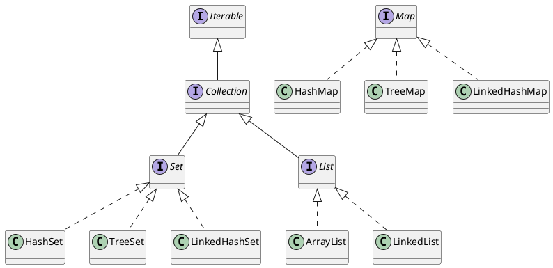

## COLLECTIONS

### ArrayList

There are a few collections in the Java Standard Library: ArrayList, LinkedList,
HashMap, LinkedHashSet, TreeMap, TreeSet and so on. To be hired for a position
of a Junior Plus Java Programmer it is REQURED to know how they are implemented.

No doubt, the only way is to look the text of an implementation. But it is assumed
in this course that to write some parodies on them is not completely meaningless
also.

Create a system of registration for a car park:

- Retrive the information about a car with its index

- Register a new car into a list of cars

- Remove a specific car from the list with the car on hand

  The operation MUST return True if the car has been removed successfully or
  False otherwise.

- Remove a specific car from the list with its index

  The operation MUST return True on succe3ss or False if the removal failed also.

- Retrive the number of cars registered

- Remove all cars from the list

Also, if there is no an index in the list the exception *IndexOutOfBoundException*
MUST be thrown out.

There is a conception of the Clean Architecture, so called tern SOLID. A one of
conception is that systems MUST BE desined at the level of its abstraction not
at the level of its implementation.

For this case it means that an interface MUST BE used to declare a list of cars.

There is a conception of the Test Drive Development, TDD. It means that the tests
MUST BE written before an implementation.

### ArrayList 2

Extend operations of the list of cars from the topic above with a new operation
add:

- The operation MUST accept a car and an index parameters and insert the car
  to be placed into the list at the given index

- Tests against insertions into the middle, head and tail MUST BE provided

There is a conception of time complexity of an algorithm. For example:

- The notation *O(1)* means that the time of an operation does not depend
  on the size of data to be processed

- The notation *O(n)* means that the time of an operation is in linear
  dependence of the size of data

The time complexity of operation of an array:

- To get an element by index - *O(1)*

- To add an element into an array or to remove it from - *O(n)*

  But for implementations that multiplies the capacily of the array if no free space
  left it is *O(log n)* in average.

### LinkedList

A linked list keeps data on nodes where the list refers to the first
node and each node refers to the next one:

- To retrive the i-th node from the current one move to the next node
  i times.

- To add an element after a specific position of a list create a new
  node, refer it to the nodes after the position and update the reference
  of the node at the position to refer the new node.

In double linked lists each node refers to the previous one also.

Solve the following car park issue:

- Provide a class LinkedCarList to implement the interface CarList on
  a doubly linked list.

### Interview about List

There are ArrayList and LinkedList in Java Standard Library.

Answer the following questiong:

- What is the difference between ArrayList and LinkedList?

  The answer that ArrayList could be based on an array and LinkedList could
  be based on a linked structure seams to be reasonable.

- What is the time complexity to retrive an element by index for ArrayList
  and for LinkedList?

  The answer that it is O(1) for the former and O(n) for the later seams to be
  reasonable. Although, the way the elements of a list are arranged internally
  is implementation and architecture dependent.

- What is the time complexity to remove an element by index for ArrayList
  and for LinkedList?

  The answer that it is O(n) for the formaer and O(1) for the later seams to be
  wrong. Indeed, the term index assume random access not a serial one.

- What are cases when it is reasonable to use LinkedList instead of ArrayList?

  The answer that it has sence when it is expected to insert elements into the head
  or into the middle of the list or remove them frequently seams to be naive. Actually,
  to use an array is required if it has relatively small size or the random access is
  strongly required.

- What problems could happen if huge ammount of elements are inserted and removed
  from ArrayList for a significant time?

  The answer that ArrayList could hold a great ammount of memory seams to be not
  appropriate. Certainly, there must be strong requirements to use an array in the
  such conditions that some redundancy does not matter. In either case, ArrayList
  provides operation to release resource if not used.

### Memory organisztion

There are two kinds of memory in Java:

- The stack. It is one mega byte long

- The heap. It is limited by the size of RAM

Variables could be kept on the stack:

- The variables of primitive types keep data on the stack

- The variables of reference types keep only references onto the data

  The data of reference types are kept on the heap.

The operator of equality, the sign *==*, compares data in the stack. So that,
the operatior:

- compares that a pair of variables are equal for primitive types

- compares that a pair of variables refer the same instance for reference
  types

  So that, the operator return true for variables of reference types iff they
  are null or refer to the same instance.

If there are no references on an instance from the stack the instance could be
removed by Java Grabage collector.

### Equals and hashcode

There is the operation *equals* at the class Object. This operation uses the
operator of equality to check equality of the current instance against an
other one. But it could be overrided to compare distinct variables of reference
types in some other way.

There is the operation *hashCode* at the class Object. If the operation
*equals* returns true for a pair of objects the operation *hashCode* MUST return
the same value for this objects also.

Thus, if the operation *equals* is overriden the operation *hashCode* MUST BE
overriden also.

There are rules related to *equals* and *hashCode*:

- If *equals* is overriden the *hashCode* MUST BE overrided also

- If hash codes of objects are different than the objects are different also

  But if hash codes are equals the related objects could be different.

There are questions that could be asked on an interview:

- How to fields compare two objects for equality of them fields?

  An answer that it is possible to override *equals* seam to be reasonable
  for some cases.

- Why it is prohibited to compare reference types with the equality operator?

  An answer that the only references are compared is right but it does not
  answer to the question. Moreover, it is accepted to compare references in
  the such way.

### HashSet

It could be required to object to keep equal elements within a collection.
There is an interface Set to fullfil such wishes in Java.

Solve the following car park issue:

- Declare an interface Set to manage a set of not equal cars with the following
  operations: add, remove, size and clear.

- Test it is not possible to add equal cars, Test it is possible to remove a car
  if an equal exists.

It is possible to implement the hash set in the following way:

- Provide an array of singly linked list, let N lists initially.

- Keep an element in the i-th list, where i is the remainer of division of the hast
  code of an element by N

- Double the number of lists when the number of elements excceds some proportion
  of N, the load factor, e.g. 0.75

  If so, elements of the i-th list must be redistributed in accord with them new
  positioin, either i-th or double i-th.

### Collection

There are some questions about collections above

- Why operations to manage elements of HashSet with an index are not provided?

- Is it granted that elements are kept in HashSet in the order they was added?

- What does happen if the operation equals of the class Car is overrided but the
  operation hashCode is not?

- What does happen if the hash code will be constant, e.g. 1? What would the
  behaviour the HashSet be?

- Why has the new interace Set been declared? Why does not the HashSet implement
  the interface List?

There is an issue:

- There are similar operations in both List and Set interfaces: add, remove, clear
  and size

- Move this operation into the new interface Collection and extend List and Set from
  it.

The Hierarchy of collection in Java:

- Collection - List, Set

- List - ArrayList, LinkedList

- Set - HashSet, TreeSet

Solve the following collectioin issue:

- Extend the interface CarCollection with the operation contains that returns
  true iff a car belongs to a car collection.

### Iterable

There is a cycle *for each* to iterate over elements of a collection. To support it
a collection MUST implement the interface Iterable. Actually, the interface
Collection of Java Standard Library is inherited from the interface Iterable.

The interface Iterable MUST implement the operation iterator. This operation
MUST return an instance of the Iterator interface, for which the operatioins
*hasNext* and *next* MUST BE implemented.

Solve the followin issue:

- Inherit the interface CarCollecitons from the interface Iterable.

- Provide tests for *for each* and implement the Interface Iterable in car
  collections.

### Interview about list and set

Answer the following questions:

- Draw the hierarchy of the Java Collection framework out.

- What is the difference of the interface Set from the interface List?

  The answer that the interface Set could not keep equals elements is wrong.
  Acutally, it is about an implementation but not about the interface.

- What is the diference of the classes ArrayLists and LinkedList?

- What is the time complexity of the followin operations on ArrayList,
  LinkedList and HashSet?

  - add an element

    The answer that it is O(1) for ArrayList is wrong. Actually, it is expected
    that access to each element MUST BE O(1).

  - add an element at a specific index

    The answer that it is O(1) for LinkedList is wrong. Actually, addition of an
    element at a specific index at O(1) assumes the random access is implemented.

  - remove and element at a specific index

    The same.

  - contains

- Could you porovide some cases when it is preffered to use ArrayList, LinkedList
  or HashSet?

  The answer that HashSet is REQUIRED if a collection MUST NOT contains equal
  elements is wrong. There is not problem to bypass this limitaion.

  The answer that ArrayList is preffered to add elements into the tail is also
  wrong. In this case either a linked list or an assotiative array are better.

- How are memory of Java orginised?

  The answer that *primitives* and "references to objects" are kept in the stack
  is wrong. Actually, an instance of a reference type could contains variables
  both of primitive and reference types in its data, not only to use *temps*.

- Could the garbage collector to destroy objects that refers by each to other only?

  The answer that it could seams to be right for now. But there could be problems
  for older versions.

- Could yout list rules for operations equals and hashcode?

- For what is the operation hashcode required?

- What does happen if a type with hash code different for equal objects are used in
  HashSet?

### TreeSet

In the course it is stated that it is not REQUIRED to have the ability
to implement trees for Junior Plus Java Programmer.

Let there are the follwoing requirements:

- Keep cars to be ordered by names of brands

- Reject to keep equals cars also

To comform this requirements in an efficient way the collection TreeSet
is preferable. All operations on TreeSet have time complexity equals to
O(log N).

To place elements into TreeSet an operation to compare elements MUST BE
provided. If so, either elements MUST implement the interface Comparable
or an implementation of the interface Comparator MUST be provided to an
instance of the TreeSet on the constraction.

Solve the follwoing enumeration problem:

- Generate a sequence of one hundred of random numbers in the range from
  0 up to 10 exclusivly.

- Use TreeSet to sort this number in the reverse order.

### HashMap

There are the following requirements:

- Keep predicate that somebody owns a car, one owner owns one car at a time

- Provide operation to add a such owner and its car, to get a car of an owner,
  to get a set of car owners, to get a set of cars, to remove an owner and her
  car

- The addition, removal and retrival of a car by its owner at O(1) in average

- Implement the collection based on a hash set.

There is a type that implements such collection in the Standdard Java Library,
namely, the type Map.

### Interview about HashMap

Answer the following questions:

- What is the interface Map?

The answer that it is a collections of pairs key-value is not wrong.
But it does not mention that it is an associative array at the first.

- What are the main operations on the interface Map?

Just to list all operations is not good answer. Actually, the main
operations are to to add an element and to retrive it.

- Is the interface Map in the hierarchy of collections?

The answer that it does not would be right if it would be asked whether
the Map belongs to the hierarchy of the Collection interfaces. But it is
asked about some collections.

- Why the interface Map is not a subclass of the Collection interface?

It is reasonable to compare the difference of *add* and *put*. Indeed,
the interface Collection is mentioned. But the right answer is that an
interface could not be a *subclass* at all.

- How the type HasmMap is implemented?

It is wrong to describe some implementation. The right answer is just to say
what the hash map is in general: an array of chanks of elements with equal
hash code.

- What is the collision and how they are solved in the HashMap?

It is wrong to mention a linked list or a field next. The right answer is
just to say what is the has map in general and to mention that the collision
is a situation when few elements has the same hash code and so must be
kept in the same chank.

- What is the time complexily of operations on the type HashMap?

It is right to answer that accessing of an element of a hash map could have
the time complexity *O(n)* in general. And it is not wrong to notice that it could
have the complexity *O(log n)* in a case of a particular implementation. But then it
must be mentioned that it is not a hash map anymore. Indeed, if it is acceptable that
accessing of an element has the complexity *O(log n)* than just use a tree
implementation. Otherwise, if the complexity must be *O(1)* drom elements of a chank
if some limit is is exeeded.

- How to retrieve all keys of a HashMap collection?

- How to retrieve all values of a HashMap collection?

- Is is granged that elements of a HashMap are ordered?

  It seams to be reasonable to refer to an implementation of a hash map.

- What happens if there is an element in the HashMap and a new element with the
  same key is added?

### Interview about implementation Set and Map

There is a list of implementation of interfaces Set and Map that MUST BE remembered
to be hired on a position of a Junior Java Plus Programmer:

- HashSet, TreeSet and LinkedHashSet implement Set

- HashMap, TreeMap and LinkedHashMap implement Map

The collections LinkedHashSet and LinkedHashMap allows to iterate elements in the order
they have been added into the collection.

Answer the follwoing question:

- Let a value is added to an implementation of HashMap by a instance of a key. Let this
  instance of a key has been modified so that its hash code changed. Is it possible
  to retrive a value by this key?

  Indeed, it is not possible to create a copy of an instance in Java in general. And
  the HashMap keeps key instances by reference. And it does not checks that a key has
  been modified.

On an interview the question could be asked as the following:

- When an element of the HashMap could be lost?

### Queue

There is the hierarchy of collections in Java as stidied:

<!--

-->

There is the interface Queue also. It extends the Collection.

There are two ways to process elements of queues:

- Last In First Out (LIFO)

  It means that an element put into a queue after all others will be retrived
  first. The such queues are called stacks in Java.

- First In First Out (FIFO)

  It means that an element put into a queue before all other will be retrived
  last. The such queues are called queues in Java.

There are operation of the interface Queue:

- *add* place an element to the tail of the queue

- *peek* get the first element of the queue

- *poll* extract the first element form the queue

Solve the following car park issue:

- Declare an interface CarQueue to extend the interface CarCollection and to
  declare operations of a FIFO queue on elements of the type Car

- Extend the type LinkedCarList to implement the interface CarQueue

  Return NULL if *peek* is called on an empty queue. Rise the exception
  *IndexOutOfBoundsException* on *poll* in the such case.

### Interwiew about Collections

The following question MUST BE answered to pass interview
about Java Collection Framework:

- Describe the hierarchy of the Java Collections Framework.

- What is the differenes of types LinkedList and ArrayList?

  To answer that the later is based on an array and the former
  is based on a linked structure is not correct. It MUST BE
  answered that the former MUST grant the time complexity *O(1)*
  to add an element at the head or at the tail of the collection
  and to accees the previous and the next element to a current
  one. And the later MUST grant the time complexity *O(1)* to
  access an i-th element of the collection.

- What are cases when it is right to use LinkedList and what are
  cases when it is right to use ArrayList?

  To answer that LinkedList MUST BE used when it is required
  to add elements at the tail and at the head frequently is not correct.
  And to answer that the ArrayList is usually could be used instead
  usual array is wrong. Instead, the time complexity MUST BE taken into
  account. Namely, ArrayList MUST BE used if it is strongly required
  to provide a random access to elements of a collections. Especially
  if the number of element in the collection is limited. Otherwise,
  LinkedList MUST BE preffered. Take into account that ArrayList keeps
  referencies and data are not kept in lines of the CPU cache.

- What are differencies of collections List and Set?

  To answer that it is not possible to keep repeated elements in Set
  is just wrong. And the answer that there are not operations in Set
  to access an element by its index is not correct. Instead, it MUST
  BE answered that the List describes an ordered set of elements
  but sets describes an unordered one.

- There is no operation get in Set. How to print all elements of a Set
  onto a terminal?

- List main implementations of the collection Set. What are their
  differences?

  It is wrong to answer that elements of HashSet are kept without an
  order. And it is not correct to answer that elements of TreeSet are
  kept sorted. The same way it is wrong that elements of a LinkedHashSet
  are kept in the order they have been added. Actually, the above is about
  the order the elements could be traversed with the Iterator.

  At the first there are two main implementations only, TreeSet and HashSet.
  A search tree is used to keep elements in the former. And an array indexed
  by hash codes of elements are used in the later. So that, the former
  grants the time complexity *O(log n)* to access any element in average and
  the later could provide the time complexity *O(1)* to access any elements
  in some cases.

- Let there is a class User with the only field of the type String. How
  instances of this class would be ordered by TreeSet.

- What are operations *equals* and *hashCode*? What are they purporse?

  It is wrong answer that the operation equals is intended to compare
  instances againts values of their fields. And it is wrong to answer that
  hashCode return a numeric implementation of an instance. Indeed, there is
  no mapping from a hash code to an instance.

  The right answer is that the operation equals allows to implement
  comparison of some objects in a required way. And the operation hashCode
  is a functional that provides a numberic characteristics of an object.

- What are rules for operations *equals* and *hashCode*?

  It is not correct to list that if equals implemented than hashCode must be
  implemented also, that if hash codes different objects must not be equal.
  The right answer is that some collections rellies that equals returns
  True, the related objects MUST HAVE equal hash codes.

- What is intention of the collection Map?

  It is not correct to answer that Map intended to keep key-value pairs of
  objects. The right answer is that the Map is an assoative arrays, i.e.
  it maps a set of objects, keys, to an other set of objects, values.

- Is it possible that to equals keys or to equals values are kept in a Map?

  It is just not correct to answer that there could not be two equals keys
  in a Map. The right answer is that set of keys is an unordered set. If so,
  it has no meaning to ask about equal keys at all.

- How is HashMap organased?

  It is wrong to list that an array of sixteen elements is created and so on.
  Also, the implementations could be different. The right answer is that
  the word hash means that elements are kept in an array indexed by their
  hash codes. Although, it is not bad to notice that a set of elements has
  equals hash codes an other data structure is used to keep them within
  the related element, bin, of the array.

- How are collisions are solved in HashMap?

  It is not very correct to describe an implementation of HashMap
  unconditionally, Probably, it is right to answer that elements with equal
  hash codes are kept in an other data structure. And just notice that
  a linked list or a search tree are used in the openjdk one.

- How an element could be lost in HashMap?

  It is wrong to answer that it happens if hash code of an element would
  be modified. The right answer is that it is not possible except some
  critical system error or a bug in an implementation. But it is not bad
  to mention that an element of a coullection could be not accessable if
  its hash code will be modified.

- How is HashSet organased?

  It is not correct to answer that a HashSet is based on a HashMap. The right
  answer is that elements of a HashSet are kept in an array indexed by their
  hash codes.

- What are the time complexitly of operations on ArrayList, LinkedList,
  HashSet, TreeSet and HashMap?

  It is just wrong that to insert or to delete an element from a specific
  position of a LinkedList has the complexity *O(1)*. Actually, *O(1)* is
  granted to access an element of the current position only.

  It is wrong that insertion of an element at the tail of an ArrayList
  has the complexity *O(1)*. ArrayList MUST grant *O(1)* to access an
  element of the collection. So that, addition element at its tail requires
  *O(log n)* in average. And it is wrong to answer that addition of an
  element into HashSet and HashMap has the complexity *O(1)* also. Take
  attention that there is the load factor, a relation between the number
  of elements and the number of bins of the underlaid array. Indeed,
  it is implementation dependant, but it is better to answer that it is
  *O(n)* in general.
